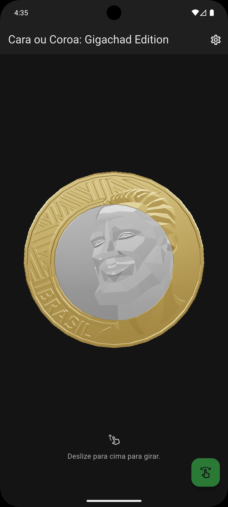
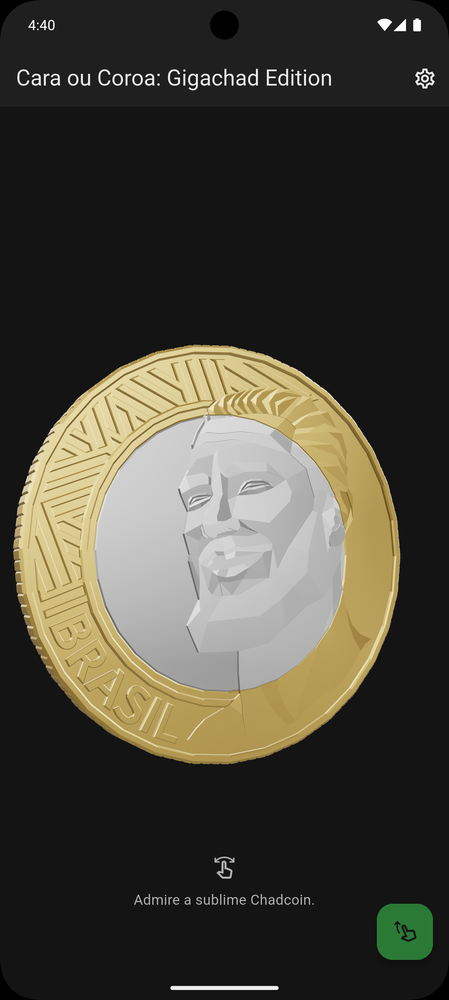
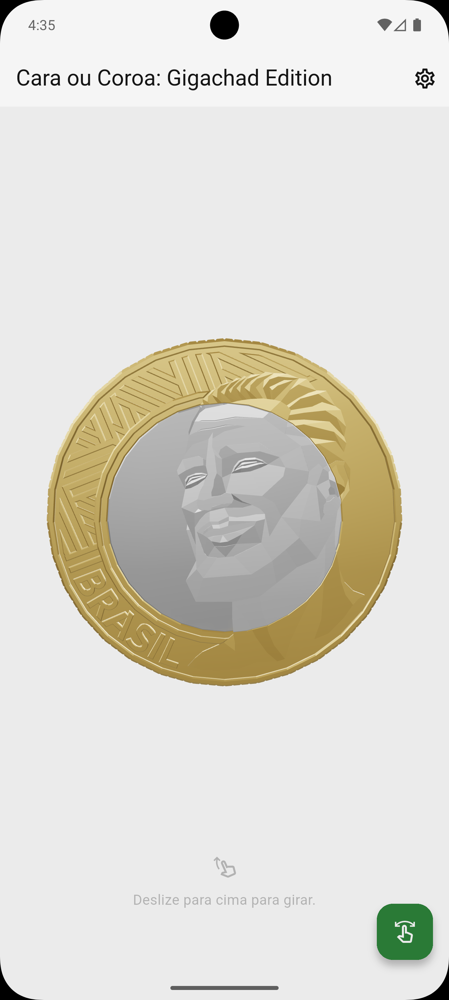
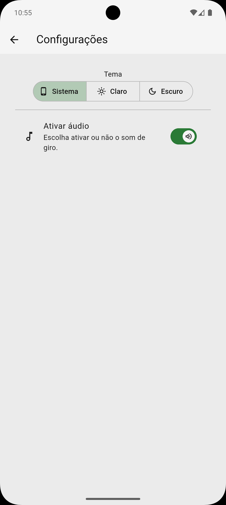

# Cara ou Coroa: Gigachad Edition

> Projeto do app de cara ou coroa mais chadbase da face da Terra.

App Flutter de cara ou coroa com uma versão 3D interativa da moeda de 1 Real com o rosto do Chad, com animações e tema dinâmico.

## Apoie o Projeto

Se você gostou do app, seja um sigma e **[deixe sua força na Play Store](https://play.google.com/store/apps/details?id=br.com.app.rlira.cara_ou_coroa_gigachad_edition)**. É só R$0,99! 🗿🍷

## PRINCIPAIS CARACTERÍSTICAS

- 🪙 **Moeda 3D interativa:** gire livremente em 360º com os dedos e admire cada detalhe da moeda mais chadbase do Brasil.
- 🎲 **Animações de giro:** arraste para cima e veja o resultado sendo decidido com uma animação 3D aleatória.
- 🌗 **Tema Light e Dark:** escolha o modo que combina com seu humor — modo “zen” ou modo “noturno alfa”.
- 🔊 **Efeito sonoro de giro:** ative o áudio para uma experiência mais imersiva.
- ⚡ **Sem enrolação:** um gesto, um giro, uma decisão. Direto ao ponto.
- 💬 **Estilo e humor:** ideal pra decidir quem paga o lanche, quem vai jogar de suporte ou quem é o verdadeiro sigma do grupo.

## Screenshots

<div align="center">
   
   
   
   
</div>

## Arquitetura

O projeto segue a arquitetura **MVVM** (Model-View-ViewModel) com gerenciamento de estado via **Provider**.

```
lib/
├── core/
│   ├── constants/
│   ├── helpers/
│   ├── services/
│   └── storage/
├── features/
│   ├── coin/
│   │   ├── view/
│   │   ├── viewmodel/
│   │   ├── widgets/
│   │   └── utils/
│   └── settings/
│       ├── view/
│       ├── viewmodel/
│       ├── service/
│       └── widgets/
├── shared/
│   ├── constants/
│   └── custom_themes/
└── main.dart
```

## Tecnologias Utilizadas

| Dependência | Versão | Descrição |
|-------------|--------|-----------|
| [flutter_3d_controller](https://pub.dev/packages/flutter_3d_controller) | ^2.2.0 | Renderização de modelos 3D (GLB) |
| [provider](https://pub.dev/packages/provider) | ^6.1.5+1 | Gerenciamento de estado |
| [audioplayers](https://pub.dev/packages/audioplayers) | ^6.5.1 | Reprodução de áudio |
| [shared_preferences](https://pub.dev/packages/shared_preferences) | ^2.5.3 | Armazenamento local |

## Requisitos de Build

### Ambiente de Desenvolvimento

- **Flutter SDK**: Canal stable (versão 3.x ou superior)
- **Dart SDK**: ^3.9.0
- **Java**: JDK 11+
- **Android Studio** ou **VS Code** com extensões Flutter/Dart

### Configuração Android

| Configuração | Valor |
|--------------|-------|
| compileSdk | 36 |
| targetSdk | 36 |
| minSdk | Definido pelo Flutter |
| Java Compatibility | 11 |

### Instalação

1. **Clone o repositório:**
   ```bash
   git clone https://github.com/seu-usuario/cara-ou-coroa-gigachad-edition.git
   cd cara-ou-coroa-gigachad-edition
   ```

2. **Instale as dependências:**
   ```bash
   flutter pub get
   ```

3. **Gere o splash screen nativo:**
   ```bash
   dart run flutter_native_splash:create
   ```

4. **Execute o app:**
   ```bash
   flutter run
   ```

## Licença

> Este repositório é público para fins de estudo e portfólio.

Copyright 2025 Renan Lira. Todos os direitos reservados.
